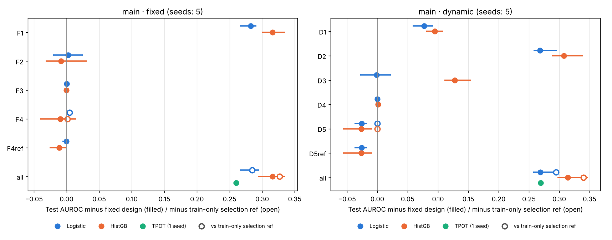
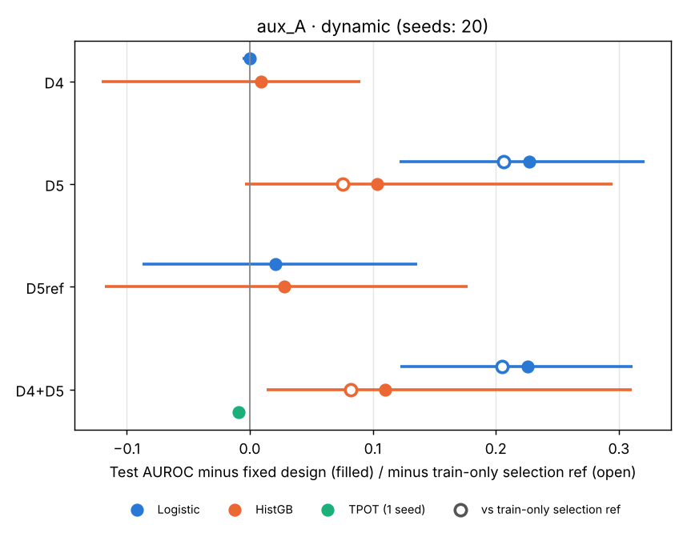
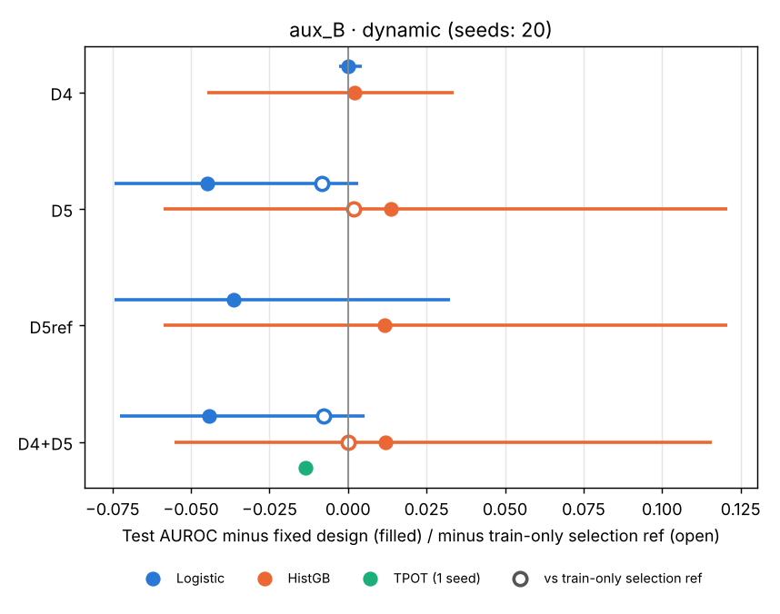

# 8단계 누수 효과 시연 결과

계획 `docs/stage8_plan.md`. v2 판정(H1·H2)과 무관한 보조 분석이다. 합성 데이터라 AUROC 절대값에는 임상적 의미가 없고, 수정 설계(또는 참조 조건) 대비 차이로 읽는다. 생성: `python -m experiment.stage8.report`.

- TPOT는 시드 1개(분할 시드 20261002)라 범위가 없고, 참조 조건에는 돌리지 않아 참조 대비 차이가 없다.
- "모두"의 참조 대비 차이는 F4 참조/D5 참조 기준이다. "모두"는 특징이 더 많아 k가 다르다 (각 절의 k 줄).

**v2 데이터에서 표현되지 않은 항목** (설계를 고치지 않고 기록)

- 보조 데이터의 고정 시점(30일 재입원) 설계: 1인당 입원 1회라 결과 양성 0 (194행). 실행하지 않음.
- 보조 데이터의 동적 설계 특징 `bun_last`, `k_last`, `hgb_min`: 보조 데이터에 bun·potassium·hemoglobin 검사가 없어 모든 행이 빈 열. 그대로 두고 0으로 채운 상수 열로 처리 (계획 3절 f).
- v1 동적 설계(안 B)에는 검사 t001~t500이 특징으로 들어가지 않는다. 그래서 "변수 많은" 조건은 8단계 시연용 설계(안 A)로만 생긴다.

## 본 데이터 (v1 설계)

데이터 `data/synth`, 시드 5개 (분할 시드 20261002 + 0~4). 차이 = 시드별 짝 차이(조건 − 기준)의 평균 [최소, 최대].

### fixed

| 조건 | 설명 | 모델 | AUROC 평균 [범위] | 수정 대비 차이 | 참조 대비 차이 |
|---|---|---|---|---|---|
| fixed | 수정 설계 | logistic | 0.648 [0.637, 0.668] |  |  |
| fixed | 수정 설계 | hgb | 0.609 [0.590, 0.625] |  |  |
| fixed | 수정 설계 | tpot | 0.672 [0.672, 0.672] |  |  |
| F1 | E12 다음 입원 병동 특징 (Q4) | logistic | 0.930 [0.925, 0.935] | +0.282 [+0.266, +0.291] |  |
| F1 | E12 다음 입원 병동 특징 (Q4) | hgb | 0.924 [0.921, 0.928] | +0.316 [+0.300, +0.335] |  |
| F2 | E06 입원 단위 분할 (Q2) | logistic | 0.651 [0.631, 0.667] | +0.002 [-0.020, +0.025] |  |
| F2 | E06 입원 단위 분할 (Q2) | hgb | 0.600 [0.593, 0.621] | -0.009 [-0.032, +0.031] |  |
| F3 | E08 중앙값 대치를 전체 데이터로 적합 (Q3) | logistic | 0.648 [0.637, 0.668] | -0.000 [-0.000, +0.000] |  |
| F3 | E08 중앙값 대치를 전체 데이터로 적합 (Q3) | hgb | 0.608 [0.587, 0.625] | -0.000 [-0.003, +0.003] |  |
| F4 | E10 상위 k개 특징 선택을 전체 데이터로 적합 (Q3) | logistic | 0.653 [0.644, 0.670] | +0.004 [+0.001, +0.009] | +0.005 [+0.000, +0.011] (기준 F4ref) |
| F4 | E10 상위 k개 특징 선택을 전체 데이터로 적합 (Q3) | hgb | 0.599 [0.584, 0.614] | -0.010 [-0.041, +0.014] | +0.002 [-0.015, +0.023] (기준 F4ref) |
| F4ref | F4 참조: 같은 특징 선택을 학습 집합에서만 적합 | logistic | 0.648 [0.640, 0.662] | -0.001 [-0.006, +0.004] |  |
| F4ref | F4 참조: 같은 특징 선택을 학습 집합에서만 적합 | hgb | 0.597 [0.581, 0.614] | -0.011 [-0.026, -0.001] |  |
| all | 누수 모두 | logistic | 0.932 [0.931, 0.934] | +0.284 [+0.266, +0.295] | +0.285 [+0.272, +0.291] (기준 F4ref) |
| all | 누수 모두 | hgb | 0.924 [0.918, 0.933] | +0.316 [+0.293, +0.335] | +0.327 [+0.318, +0.344] (기준 F4ref) |
| all | 누수 모두 | tpot | 0.932 [0.932, 0.932] | +0.260 |  |

fixed 시드별 AUROC

| 조건 | 모델 | 0 | 1 | 2 | 3 | 4 |
|---|---|---|---|---|---|---|
| fixed | logistic | 0.668 | 0.651 | 0.643 | 0.642 | 0.637 |
| fixed | hgb | 0.590 | 0.609 | 0.600 | 0.619 | 0.625 |
| fixed | tpot | 0.672 |  |  |  |  |
| F1 | logistic | 0.935 | 0.931 | 0.934 | 0.928 | 0.925 |
| F1 | hgb | 0.925 | 0.921 | 0.928 | 0.922 | 0.925 |
| F2 | logistic | 0.660 | 0.631 | 0.667 | 0.651 | 0.644 |
| F2 | hgb | 0.621 | 0.596 | 0.595 | 0.594 | 0.593 |
| F3 | logistic | 0.668 | 0.651 | 0.643 | 0.642 | 0.637 |
| F3 | hgb | 0.587 | 0.609 | 0.602 | 0.619 | 0.625 |
| F4 | logistic | 0.670 | 0.653 | 0.652 | 0.644 | 0.644 |
| F4 | hgb | 0.604 | 0.598 | 0.593 | 0.614 | 0.584 |
| F4ref | logistic | 0.662 | 0.651 | 0.641 | 0.644 | 0.640 |
| F4ref | hgb | 0.581 | 0.593 | 0.599 | 0.614 | 0.599 |
| all | logistic | 0.934 | 0.931 | 0.932 | 0.933 | 0.932 |
| all | hgb | 0.925 | 0.922 | 0.924 | 0.933 | 0.918 |
| all | tpot | 0.932 |  |  |  |  |

### dynamic

| 조건 | 설명 | 모델 | AUROC 평균 [범위] | 수정 대비 차이 | 참조 대비 차이 |
|---|---|---|---|---|---|
| fixed | 수정 설계 | logistic | 0.715 [0.685, 0.728] |  |  |
| fixed | 수정 설계 | hgb | 0.675 [0.640, 0.692] |  |  |
| fixed | 수정 설계 | tpot | 0.719 [0.719, 0.719] |  |  |
| D1 | E01 이번 입원 AKI 진단 코드 N17 (Q1) | logistic | 0.792 [0.765, 0.811] | +0.077 [+0.058, +0.092] |  |
| D1 | E01 이번 입원 AKI 진단 코드 N17 (Q1) | hgb | 0.769 [0.748, 0.786] | +0.095 [+0.080, +0.108] |  |
| D2 | E03 입원 전체 기간 최고 크레아티닌 (Q1) | logistic | 0.983 [0.982, 0.985] | +0.268 [+0.258, +0.297] |  |
| D2 | E03 입원 전체 기간 최고 크레아티닌 (Q1) | hgb | 0.982 [0.979, 0.985] | +0.307 [+0.288, +0.339] |  |
| D3 | 행(예측 시점) 단위 분할 (Q2) | logistic | 0.714 [0.700, 0.727] | -0.001 [-0.028, +0.022] |  |
| D3 | 행(예측 시점) 단위 분할 (Q2) | hgb | 0.802 [0.790, 0.830] | +0.128 [+0.110, +0.155] |  |
| D4 | E08 중앙값 대치를 전체 데이터로 적합 (Q3) | logistic | 0.715 [0.685, 0.728] | -0.000 [-0.000, +0.000] |  |
| D4 | E08 중앙값 대치를 전체 데이터로 적합 (Q3) | hgb | 0.676 [0.646, 0.695] | +0.001 [-0.003, +0.006] |  |
| D5 | E10 상위 k개 특징 선택을 전체 데이터로 적합 (Q3) | logistic | 0.689 [0.662, 0.702] | -0.026 [-0.037, -0.017] | +0.000 [+0.000, +0.000] (기준 D5ref) |
| D5 | E10 상위 k개 특징 선택을 전체 데이터로 적합 (Q3) | hgb | 0.648 [0.611, 0.675] | -0.026 [-0.057, -0.009] | +0.000 [+0.000, +0.000] (기준 D5ref) |
| D5ref | D5 참조: 같은 특징 선택을 학습 집합에서만 적합 | logistic | 0.689 [0.662, 0.702] | -0.026 [-0.037, -0.017] |  |
| D5ref | D5 참조: 같은 특징 선택을 학습 집합에서만 적합 | hgb | 0.648 [0.611, 0.675] | -0.026 [-0.057, -0.009] |  |
| all | 누수 모두 | logistic | 0.984 [0.983, 0.985] | +0.269 [+0.257, +0.298] | +0.295 [+0.282, +0.321] (기준 D5ref) |
| all | 누수 모두 | hgb | 0.989 [0.987, 0.989] | +0.314 [+0.297, +0.348] | +0.340 [+0.314, +0.376] (기준 D5ref) |
| all | 누수 모두 | tpot | 0.988 [0.988, 0.988] | +0.269 |  |

dynamic 시드별 AUROC

| 조건 | 모델 | 0 | 1 | 2 | 3 | 4 |
|---|---|---|---|---|---|---|
| fixed | logistic | 0.724 | 0.728 | 0.685 | 0.719 | 0.720 |
| fixed | hgb | 0.692 | 0.683 | 0.640 | 0.684 | 0.674 |
| fixed | tpot | 0.719 |  |  |  |  |
| D1 | logistic | 0.783 | 0.805 | 0.765 | 0.811 | 0.796 |
| D1 | hgb | 0.773 | 0.775 | 0.748 | 0.786 | 0.765 |
| D2 | logistic | 0.983 | 0.985 | 0.982 | 0.983 | 0.983 |
| D2 | hgb | 0.981 | 0.985 | 0.979 | 0.981 | 0.984 |
| D3 | logistic | 0.727 | 0.700 | 0.708 | 0.727 | 0.709 |
| D3 | hgb | 0.803 | 0.794 | 0.794 | 0.830 | 0.790 |
| D4 | logistic | 0.724 | 0.728 | 0.685 | 0.719 | 0.720 |
| D4 | hgb | 0.695 | 0.681 | 0.646 | 0.684 | 0.674 |
| D5 | logistic | 0.687 | 0.702 | 0.662 | 0.702 | 0.695 |
| D5 | hgb | 0.636 | 0.663 | 0.611 | 0.675 | 0.656 |
| D5ref | logistic | 0.687 | 0.702 | 0.662 | 0.702 | 0.695 |
| D5ref | hgb | 0.636 | 0.663 | 0.611 | 0.675 | 0.656 |
| all | logistic | 0.984 | 0.985 | 0.983 | 0.985 | 0.983 |
| all | hgb | 0.989 | 0.989 | 0.987 | 0.989 | 0.988 |
| all | tpot | 0.988 |  |  |  |  |

### TPOT 실행 점검

| 유형 | 조건 | 조각 사이 걸친 가족 | 넘긴 조각 객체 그대로 사용 | split 호출 | 걸린 시간(초) | AUROC | 고른 파이프라인 |
|---|---|---|---|---|---|---|---|
| fixed | fixed | 0 | 예 | 55 | 217.8 | 0.672 | `Pipeline(steps=[('standardscaler', StandardScaler()), ('selectfwe', SelectFwe(alpha=0.0052992371021)), ('featureunion-1', FeatureUnion(transformer_list=[('skiptransformer', SkipTransformer()), ('passthrough', Passthrough())])), ('featureunion-2', FeatureUnion(transformer_list=[('skiptransformer', SkipTransformer()),` |
| fixed | all | 0 | 예 | 53 | 170.6 | 0.932 | `Pipeline(steps=[('standardscaler', StandardScaler()), ('selectfwe', SelectFwe(alpha=0.0003913199737)), ('featureunion-1', FeatureUnion(transformer_list=[('skiptransformer', SkipTransformer()), ('passthrough', Passthrough())])), ('featureunion-2', FeatureUnion(transformer_list=[('skiptransformer', SkipTransformer()),` |
| dynamic | fixed | 0 | 예 | 46 | 354.8 | 0.719 | `Pipeline(steps=[('standardscaler', StandardScaler()), ('variancethreshold', VarianceThreshold(threshold=0.0398412133704)), ('featureunion-1', FeatureUnion(transformer_list=[('featureunion', FeatureUnion(transformer_list=[('quantiletransformer', QuantileTransformer(n_quantiles=4954, output_distribution=` |
| dynamic | all | 0 | 예 | 43 | 310.7 | 0.988 | `Pipeline(steps=[('normalizer', Normalizer(norm=np.str_('max'))), ('selectfwe', SelectFwe(alpha=0.0001507604445)), ('featureunion-1', FeatureUnion(transformer_list=[('skiptransformer', SkipTransformer()), ('passthrough', Passthrough())])), ('featureunion-2', FeatureUnion(transformer_list=[('skiptransformer', SkipTransforme` |

특징 선택 뒤 열 수 k (계획 3절 d): fixed/F4 8, fixed/all 9, fixed/F4ref 8, dynamic/D5 6, dynamic/all 8, dynamic/D5ref 6

수정 설계에서 학습·시험 양쪽에 든 가족 수: fixed 0, dynamic 0

## 보조 데이터 안 A (8단계 시연용 설계: v1 동적 + 검사 500종)

데이터 `data/synth_aux`, 시드 20개 (분할 시드 20261002 + 0~19). 차이 = 시드별 짝 차이(조건 − 기준)의 평균 [최소, 최대].

### dynamic

| 조건 | 설명 | 모델 | AUROC 평균 [범위] | 수정 대비 차이 | 참조 대비 차이 |
|---|---|---|---|---|---|
| fixed | 수정 설계 | logistic | 0.555 [0.390, 0.682] |  |  |
| fixed | 수정 설계 | hgb | 0.557 [0.432, 0.649] |  |  |
| fixed | 수정 설계 | tpot | 0.632 [0.632, 0.632] |  |  |
| D4 | E08 중앙값 대치를 전체 데이터로 적합 (Q3) | logistic | 0.555 [0.388, 0.685] | -0.000 [-0.006, +0.004] |  |
| D4 | E08 중앙값 대치를 전체 데이터로 적합 (Q3) | hgb | 0.566 [0.446, 0.680] | +0.009 [-0.121, +0.090] |  |
| D5 | E10 상위 k개 특징 선택을 전체 데이터로 적합 (Q3) | logistic | 0.783 [0.649, 0.867] | +0.227 [+0.122, +0.321] | +0.206 [+0.105, +0.363] (기준 D5ref) |
| D5 | E10 상위 k개 특징 선택을 전체 데이터로 적합 (Q3) | hgb | 0.660 [0.563, 0.728] | +0.104 [-0.004, +0.295] | +0.076 [-0.002, +0.165] (기준 D5ref) |
| D5ref | D5 참조: 같은 특징 선택을 학습 집합에서만 적합 | logistic | 0.577 [0.416, 0.710] | +0.021 [-0.087, +0.136] |  |
| D5ref | D5 참조: 같은 특징 선택을 학습 집합에서만 적합 | hgb | 0.585 [0.496, 0.698] | +0.028 [-0.118, +0.177] |  |
| D4+D5 | D4+D5 | logistic | 0.781 [0.644, 0.857] | +0.226 [+0.122, +0.311] | +0.205 [+0.095, +0.362] (기준 D5ref) |
| D4+D5 | D4+D5 | hgb | 0.667 [0.583, 0.742] | +0.110 [+0.014, +0.311] | +0.082 [+0.010, +0.154] (기준 D5ref) |
| D4+D5 | D4+D5 | tpot | 0.623 [0.623, 0.623] | -0.009 |  |

dynamic 시드별 AUROC

| 조건 | 모델 | 0 | 1 | 2 | 3 | 4 | 5 | 6 | 7 | 8 | 9 | 10 | 11 | 12 | 13 | 14 | 15 | 16 | 17 | 18 | 19 |
|---|---|---|---|---|---|---|---|---|---|---|---|---|---|---|---|---|---|---|---|---|---|
| fixed | logistic | 0.629 | 0.598 | 0.574 | 0.682 | 0.481 | 0.603 | 0.494 | 0.553 | 0.557 | 0.498 | 0.422 | 0.638 | 0.546 | 0.507 | 0.618 | 0.507 | 0.631 | 0.622 | 0.390 | 0.559 |
| fixed | hgb | 0.649 | 0.493 | 0.590 | 0.596 | 0.571 | 0.565 | 0.441 | 0.646 | 0.599 | 0.512 | 0.614 | 0.583 | 0.498 | 0.589 | 0.432 | 0.573 | 0.622 | 0.516 | 0.502 | 0.539 |
| fixed | tpot | 0.632 |  |  |  |  |  |  |  |  |  |  |  |  |  |  |  |  |  |  |  |
| D4 | logistic | 0.631 | 0.600 | 0.571 | 0.685 | 0.481 | 0.602 | 0.495 | 0.555 | 0.558 | 0.492 | 0.423 | 0.639 | 0.542 | 0.507 | 0.617 | 0.508 | 0.635 | 0.622 | 0.388 | 0.559 |
| D4 | hgb | 0.594 | 0.466 | 0.680 | 0.635 | 0.527 | 0.555 | 0.446 | 0.526 | 0.594 | 0.592 | 0.630 | 0.581 | 0.575 | 0.613 | 0.512 | 0.611 | 0.618 | 0.498 | 0.483 | 0.586 |
| D5 | logistic | 0.776 | 0.800 | 0.815 | 0.804 | 0.787 | 0.780 | 0.792 | 0.816 | 0.724 | 0.779 | 0.722 | 0.827 | 0.867 | 0.785 | 0.800 | 0.756 | 0.812 | 0.772 | 0.649 | 0.793 |
| D5 | hgb | 0.714 | 0.697 | 0.696 | 0.634 | 0.650 | 0.635 | 0.615 | 0.707 | 0.596 | 0.650 | 0.615 | 0.664 | 0.728 | 0.656 | 0.727 | 0.651 | 0.704 | 0.612 | 0.563 | 0.694 |
| D5ref | logistic | 0.596 | 0.694 | 0.710 | 0.670 | 0.513 | 0.632 | 0.490 | 0.627 | 0.559 | 0.416 | 0.462 | 0.551 | 0.623 | 0.468 | 0.630 | 0.567 | 0.613 | 0.657 | 0.425 | 0.628 |
| D5ref | hgb | 0.672 | 0.635 | 0.698 | 0.607 | 0.603 | 0.571 | 0.518 | 0.631 | 0.551 | 0.553 | 0.496 | 0.584 | 0.563 | 0.621 | 0.609 | 0.561 | 0.604 | 0.562 | 0.514 | 0.545 |
| D4+D5 | logistic | 0.776 | 0.797 | 0.805 | 0.804 | 0.788 | 0.780 | 0.805 | 0.821 | 0.728 | 0.778 | 0.710 | 0.838 | 0.857 | 0.779 | 0.794 | 0.756 | 0.810 | 0.766 | 0.644 | 0.793 |
| D4+D5 | hgb | 0.682 | 0.712 | 0.731 | 0.659 | 0.650 | 0.615 | 0.603 | 0.704 | 0.664 | 0.706 | 0.628 | 0.602 | 0.700 | 0.680 | 0.742 | 0.670 | 0.727 | 0.591 | 0.583 | 0.682 |
| D4+D5 | tpot | 0.623 |  |  |  |  |  |  |  |  |  |  |  |  |  |  |  |  |  |  |  |

### TPOT 실행 점검

| 유형 | 조건 | 조각 사이 걸친 가족 | 넘긴 조각 객체 그대로 사용 | split 호출 | 걸린 시간(초) | AUROC | 고른 파이프라인 |
|---|---|---|---|---|---|---|---|
| dynamic | fixed | 0 | 예 | 54 | 199.0 | 0.632 | `Pipeline(steps=[('maxabsscaler', MaxAbsScaler()), ('rfe', RFE(estimator=ExtraTreesClassifier(bootstrap=np.False_, criterion=np.str_('entropy'), max_features=0.7445015513014, min_samples_split=19, n_jobs=1, random_state=20261002), step=0.6077668431089)), ('featureunion-1` |
| dynamic | D4+D5 | 0 | 예 | 58 | 181.7 | 0.623 | `Pipeline(steps=[('standardscaler', StandardScaler()), ('rfe', RFE(estimator=ExtraTreesClassifier(bootstrap=np.False_, class_weight='balanced', criterion=np.str_('entropy'), max_features=0.5358850678911, min_samples_leaf=10, min_samples_split=16, n_jobs=1,` |

특징 선택 뒤 열 수 k (계획 3절 d): dynamic/D5 256, dynamic/D4+D5 256, dynamic/D5ref 256

수정 설계에서 학습·시험 양쪽에 든 가족 수: dynamic 0

전부 비어 있는 열 (계획 3절 f): dynamic/fixed bun_last, hgb_min, k_last; dynamic/D4 bun_last, hgb_min, k_last; dynamic/D5 bun_last, hgb_min, k_last; dynamic/D4+D5 bun_last, hgb_min, k_last; dynamic/D5ref bun_last, hgb_min, k_last

## 보조 데이터 안 B (v1 동적 설계 그대로)

데이터 `data/synth_aux`, 시드 20개 (분할 시드 20261002 + 0~19). 차이 = 시드별 짝 차이(조건 − 기준)의 평균 [최소, 최대].

### dynamic

| 조건 | 설명 | 모델 | AUROC 평균 [범위] | 수정 대비 차이 | 참조 대비 차이 |
|---|---|---|---|---|---|
| fixed | 수정 설계 | logistic | 0.635 [0.523, 0.809] |  |  |
| fixed | 수정 설계 | hgb | 0.589 [0.447, 0.692] |  |  |
| fixed | 수정 설계 | tpot | 0.508 [0.508, 0.508] |  |  |
| D4 | E08 중앙값 대치를 전체 데이터로 적합 (Q3) | logistic | 0.635 [0.523, 0.808] | -0.000 [-0.003, +0.004] |  |
| D4 | E08 중앙값 대치를 전체 데이터로 적합 (Q3) | hgb | 0.591 [0.470, 0.711] | +0.002 [-0.045, +0.034] |  |
| D5 | E10 상위 k개 특징 선택을 전체 데이터로 적합 (Q3) | logistic | 0.590 [0.470, 0.780] | -0.045 [-0.074, +0.003] | -0.008 [-0.070, +0.013] (기준 D5ref) |
| D5 | E10 상위 k개 특징 선택을 전체 데이터로 적합 (Q3) | hgb | 0.603 [0.487, 0.702] | +0.014 [-0.059, +0.121] | +0.002 [-0.041, +0.039] (기준 D5ref) |
| D5ref | D5 참조: 같은 특징 선택을 학습 집합에서만 적합 | logistic | 0.598 [0.480, 0.800] | -0.036 [-0.074, +0.033] |  |
| D5ref | D5 참조: 같은 특징 선택을 학습 집합에서만 적합 | hgb | 0.601 [0.487, 0.702] | +0.012 [-0.059, +0.121] |  |
| D4+D5 | D4+D5 | logistic | 0.591 [0.470, 0.780] | -0.044 [-0.072, +0.005] | -0.008 [-0.072, +0.013] (기준 D5ref) |
| D4+D5 | D4+D5 | hgb | 0.601 [0.503, 0.701] | +0.012 [-0.055, +0.116] | +0.000 [-0.032, +0.030] (기준 D5ref) |
| D4+D5 | D4+D5 | tpot | 0.495 [0.495, 0.495] | -0.013 |  |

dynamic 시드별 AUROC

| 조건 | 모델 | 0 | 1 | 2 | 3 | 4 | 5 | 6 | 7 | 8 | 9 | 10 | 11 | 12 | 13 | 14 | 15 | 16 | 17 | 18 | 19 |
|---|---|---|---|---|---|---|---|---|---|---|---|---|---|---|---|---|---|---|---|---|---|
| fixed | logistic | 0.649 | 0.685 | 0.665 | 0.687 | 0.654 | 0.664 | 0.523 | 0.781 | 0.542 | 0.549 | 0.601 | 0.643 | 0.549 | 0.666 | 0.809 | 0.670 | 0.613 | 0.587 | 0.531 | 0.630 |
| fixed | hgb | 0.543 | 0.682 | 0.524 | 0.566 | 0.447 | 0.632 | 0.675 | 0.692 | 0.571 | 0.624 | 0.598 | 0.528 | 0.571 | 0.593 | 0.624 | 0.595 | 0.598 | 0.630 | 0.607 | 0.483 |
| fixed | tpot | 0.508 |  |  |  |  |  |  |  |  |  |  |  |  |  |  |  |  |  |  |  |
| D4 | logistic | 0.649 | 0.686 | 0.666 | 0.687 | 0.652 | 0.663 | 0.523 | 0.780 | 0.543 | 0.550 | 0.600 | 0.645 | 0.546 | 0.667 | 0.808 | 0.674 | 0.612 | 0.587 | 0.530 | 0.629 |
| D4 | hgb | 0.543 | 0.683 | 0.516 | 0.578 | 0.470 | 0.628 | 0.674 | 0.711 | 0.556 | 0.644 | 0.591 | 0.528 | 0.546 | 0.548 | 0.645 | 0.628 | 0.606 | 0.631 | 0.611 | 0.485 |
| D5 | logistic | 0.628 | 0.659 | 0.637 | 0.658 | 0.582 | 0.597 | 0.526 | 0.780 | 0.480 | 0.488 | 0.548 | 0.627 | 0.498 | 0.605 | 0.743 | 0.596 | 0.597 | 0.513 | 0.470 | 0.571 |
| D5 | hgb | 0.559 | 0.702 | 0.586 | 0.667 | 0.568 | 0.579 | 0.616 | 0.658 | 0.585 | 0.628 | 0.571 | 0.498 | 0.580 | 0.696 | 0.666 | 0.625 | 0.608 | 0.618 | 0.558 | 0.487 |
| D5ref | logistic | 0.628 | 0.659 | 0.626 | 0.661 | 0.582 | 0.597 | 0.526 | 0.800 | 0.480 | 0.489 | 0.548 | 0.614 | 0.568 | 0.605 | 0.743 | 0.596 | 0.645 | 0.513 | 0.518 | 0.571 |
| D5ref | hgb | 0.559 | 0.702 | 0.603 | 0.664 | 0.568 | 0.579 | 0.616 | 0.635 | 0.585 | 0.589 | 0.571 | 0.493 | 0.579 | 0.696 | 0.666 | 0.625 | 0.585 | 0.618 | 0.598 | 0.487 |
| D4+D5 | logistic | 0.629 | 0.656 | 0.639 | 0.659 | 0.581 | 0.598 | 0.528 | 0.780 | 0.482 | 0.488 | 0.547 | 0.627 | 0.496 | 0.606 | 0.743 | 0.600 | 0.596 | 0.519 | 0.470 | 0.569 |
| D4+D5 | hgb | 0.568 | 0.691 | 0.591 | 0.663 | 0.563 | 0.577 | 0.620 | 0.644 | 0.577 | 0.619 | 0.560 | 0.511 | 0.565 | 0.701 | 0.665 | 0.621 | 0.610 | 0.605 | 0.567 | 0.503 |
| D4+D5 | tpot | 0.495 |  |  |  |  |  |  |  |  |  |  |  |  |  |  |  |  |  |  |  |

### TPOT 실행 점검

| 유형 | 조건 | 조각 사이 걸친 가족 | 넘긴 조각 객체 그대로 사용 | split 호출 | 걸린 시간(초) | AUROC | 고른 파이프라인 |
|---|---|---|---|---|---|---|---|
| dynamic | fixed | 0 | 예 | 55 | 93.0 | 0.508 | `Pipeline(steps=[('standardscaler', StandardScaler()), ('variancethreshold', VarianceThreshold(threshold=0.0398412133704)), ('featureunion-1', FeatureUnion(transformer_list=[('featureunion', FeatureUnion(transformer_list=[('quantiletransformer', QuantileTransformer(n_quantiles=346, output_distribution=n` |
| dynamic | D4+D5 | 0 | 예 | 57 | 132.2 | 0.495 | `Pipeline(steps=[('standardscaler', StandardScaler()), ('variancethreshold', VarianceThreshold(threshold=0.0008877546962)), ('featureunion-1', FeatureUnion(transformer_list=[('featureunion', FeatureUnion(transformer_list=[('quantiletransformer', QuantileTransformer(n_quantiles=346, output_distribution=n` |

특징 선택 뒤 열 수 k (계획 3절 d): dynamic/D5 6, dynamic/D4+D5 6, dynamic/D5ref 6

수정 설계에서 학습·시험 양쪽에 든 가족 수: dynamic 0

전부 비어 있는 열 (계획 3절 f): dynamic/fixed bun_last, hgb_min, k_last; dynamic/D4 bun_last, hgb_min, k_last; dynamic/D5 bun_last, hgb_min, k_last; dynamic/D4+D5 bun_last, hgb_min, k_last; dynamic/D5ref bun_last, hgb_min, k_last

